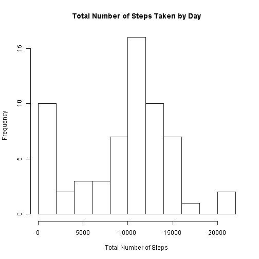
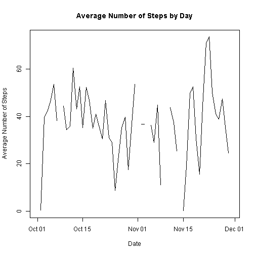
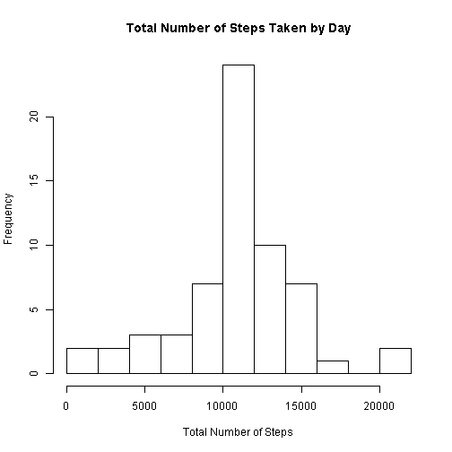
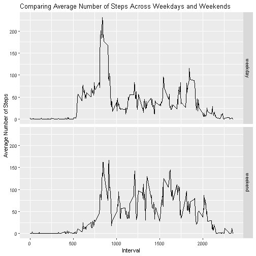

-------------------------------------------------
-------------------------------------------------
title: "PA1_template"
author: "Michael
-------------------------------------------------

Let's set echo = TRUE globally to produce codes in the document


We are going to read in our data and change date column to date format as well as interval column to factor


```r
activity <- read.csv("activity.csv")
activity$date <- as.Date(as.character(activity$date))
activity$interval <- as.factor(activity$interval)
head(activity, 3)
```

```
##   steps       date interval
## 1    NA 2012-10-01        0
## 2    NA 2012-10-01        5
## 3    NA 2012-10-01       10
```

```r
str(activity)
```

```
## 'data.frame':	17568 obs. of  3 variables:
##  $ steps   : int  NA NA NA NA NA NA NA NA NA NA ...
##  $ date    : Date, format: "2012-10-01" "2012-10-01" "2012-10-01" "2012-10-01" ...
##  $ interval: Factor w/ 288 levels "0","5","10","15",..: 1 2 3 4 5 6 7 8 9 10 ...
```

Let's load some dependencies for the rest of the project


```r
library(dplyr)
library(ggplot2)
library(lattice)
```

Let's calculate the total number of steps taken by day


```r
total_Steps_daily <- tapply(activity$steps, activity$date, sum, na.rm=TRUE)
head(total_Steps_daily)
```

```
## 2012-10-01 2012-10-02 2012-10-03 2012-10-04 2012-10-05 2012-10-06 
##          0        126      11352      12116      13294      15420
```

Let's see a histogram of the above calculated total number of steps daily


```r
hist(total_Steps_daily, breaks = 10, main = "Total Number of Steps Taken by Day", xlab = "Total Number of Steps")
```



Let's calculate the daily mean and median number of steps


```r
meanSteps_daily <- tapply(activity$steps, activity$date, mean, na.rm=TRUE)
medianSteps_daily <- tapply(activity$steps, activity$date, median, na.rm=TRUE)
```

Let's plot the time series of mean number of steps by day


```r
plot(unique(activity$date), meanSteps_daily, type= "l", ylab = "Average Number of Steps", xlab = "Date", main = "Average Number of Steps by Day")
```



Let's see the 5-minute interval that, on average, contains the maximum number of steps


```r
group_by(activity, interval) %>% summarise(mean_number_of_steps = mean(steps, na.rm = TRUE)) %>% filter(mean_number_of_steps==max(mean_number_of_steps, na.rm = TRUE)) %>% print
```

```
## # A tibble: 1 x 2
##   interval mean_number_of_steps
##   <fct>                   <dbl>
## 1 835                      206.
```

Let's fill in our NA's with a simple average of steps taken in an interval. This is not the best but we will make do with it for now. It at least works better than filling NA here with daily average because there are some days where not recording was done at all, so it is pointless to find an average of nothing. On the down side, this approach here heavily exagerates counts for days on which no measurements were taken.


```r
new_activity <- activity %>%  group_by(interval) %>%
        mutate_all(funs(ifelse(is.na(.), mean(., na.rm = TRUE),.)))
```

```
## `mutate_all()` ignored the following grouping variables:
## Column `interval`
## Use `mutate_at(df, vars(-group_cols()), myoperation)` to silence the message.
```

```r
new_activity <- data.frame(new_activity, date = activity$date)[, -2]
names(new_activity)[3] <- "date"
head(new_activity, 3)
```

```
##       steps interval       date
## 1 1.7169811        0 2012-10-01
## 2 0.3396226        5 2012-10-01
## 3 0.1320755       10 2012-10-01
```

Let's see the total number of steps taken after the fill.na is imputed


```r
new_total_Steps_daily <- tapply(new_activity$steps, new_activity$date, sum, na.rm=TRUE)
head(new_total_Steps_daily)
```

```
## 2012-10-01 2012-10-02 2012-10-03 2012-10-04 2012-10-05 2012-10-06 
##   10766.19     126.00   11352.00   12116.00   13294.00   15420.00
```

Let's see how the histogram changes with that from above.


```r
hist(new_total_Steps_daily, breaks = 10, main = "Total Number of Steps Taken by Day", xlab = "Total Number of Steps")
```



In this next step, we are going to compute and compare the average number of steps at five-minute intervals across weekdays and weekends.  We will first have to create a 'type of day' variable (column).


```r
new_activity$typeofday <- ifelse(weekdays(new_activity$date) %in% c("Saturday", "Sunday"), "weekend", "weekday")
head(new_activity)
```

```
##       steps interval       date typeofday
## 1 1.7169811        0 2012-10-01   weekday
## 2 0.3396226        5 2012-10-01   weekday
## 3 0.1320755       10 2012-10-01   weekday
## 4 0.1509434       15 2012-10-01   weekday
## 5 0.0754717       20 2012-10-01   weekday
## 6 2.0943396       25 2012-10-01   weekday
```

Now, let's proceed to getting the average number steps by weekdays and weekends


```r
mean_steps_new_activity <- group_by(new_activity, interval, typeofday) %>% summarise(mean_steps = mean(steps, na.rm = TRUE))
head(mean_steps_new_activity)
```

```
## # A tibble: 6 x 3
## # Groups:   interval [3]
##   interval typeofday mean_steps
##   <fct>    <chr>          <dbl>
## 1 0        weekday       2.25  
## 2 0        weekend       0.215 
## 3 5        weekday       0.445 
## 4 5        weekend       0.0425
## 5 10       weekday       0.173 
## 6 10       weekend       0.0165
```

Now, let's produce our panel plots comparing weekends to weekdays, using my favorite package ggplot.


```r
g <- ggplot(mean_steps_new_activity, aes(x=as.numeric(as.character(interval)), y=mean_steps, group=1))
g + geom_line() + facet_grid(typeofday~.) + labs(x="Interval",y="Average Number of Steps", title="Comparing Average Number of Steps Across Weekdays and Weekends")
```


